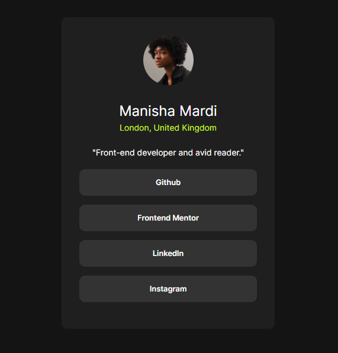

# Frontend Mentor - Social links profile solution

This is a solution to the [Social links profile challenge on Frontend Mentor](https://www.frontendmentor.io/challenges/social-links-profile-UG32l9m6dQ). Frontend Mentor challenges help you improve your coding skills by building realistic projects. 

## Table of contents

- [Overview](#overview)
  - [The challenge](#the-challenge)
  - [Screenshot](#screenshot)
  - [Links](#links)
- [My process](#my-process)
  - [Built with](#built-with)
  - [What I learned](#what-i-learned)
  - [Continued development](#continued-development)
- [Author](#author)
- [Acknowledgments](#acknowledgments)

## Overview

### The challenge

Users should be able to:

- See hover and focus states for all interactive elements on the page

### Screenshot

### Links

- Solution URL: (https://github.com/mardimanisha/FrontendMentor-social-links-profile)
- Live Site URL: (https://frontend-mentor-social-links-profile-puce.vercel.app/)

## My process

### Built with

- Semantic HTML5 markup
- CSS custom properties
- Flexbox
- Mobile-first workflow

### What I learned

#### 1. HTML Structure and Semantic Markup
Understanding the importance of semantic HTML helps in creating accessible and SEO-friendly web pages.

Learning:

- Use of semantic tags like <header>, <main>, <footer>, <a> and proper use of headings.
- Using anchor tags <a> to create links.
- Structuring HTML for readability and maintainability.

#### 2. CSS Styling and Responsive Design
Learning how to style elements using CSS and making the design responsive for different screen sizes.

Learning:

- Using media queries for responsiveness.
- Utilizing CSS Flexbox for layout.
- Styling elements to match design specifications.

#### 3. Using Google Fonts
Integrating custom fonts from Google Fonts to enhance the visual appeal of the webpage.

Learning:

- How to include Google Fonts in your project.
- Applying the custom fonts to specific elements.

#### 5. Version Control with Git
Understanding the basics of using Git for version control, including initializing a repository, making commits, and pushing changes to a remote repository.

Learning:

- Initializing a Git repository.
- Adding and committing changes.
- Pushing changes to a remote repository.

### Continued development

Working on the social links profile card project has been a great learning experience, and there are several areas I want to continue focusing on in future projects to refine and perfect my skills:

#### 1. Advanced CSS Techniques

- ##### Flexbox and Grid Layouts: 
While I have a basic understanding of Flexbox, I want to dive deeper into CSS Grid to create more complex and responsive layouts.
- ##### CSS Variables and Custom Properties: 
Learning to use CSS variables for better maintainability and reusability of styles.
- ##### Animations and Transitions:
Enhancing user experience with smooth animations and transitions.

## Author

- Frontend Mentor - [@yourusername](https://www.frontendmentor.io/profile/mardimanisha)

## Acknowledgments

This is where you can give a hat tip to anyone who helped you out on this project. Perhaps you worked in a team or got some inspiration from someone else's solution. This is the perfect place to give them some credit.

**Note: Delete this note and edit this section's content as necessary. If you completed this challenge by yourself, feel free to delete this section entirely.**
